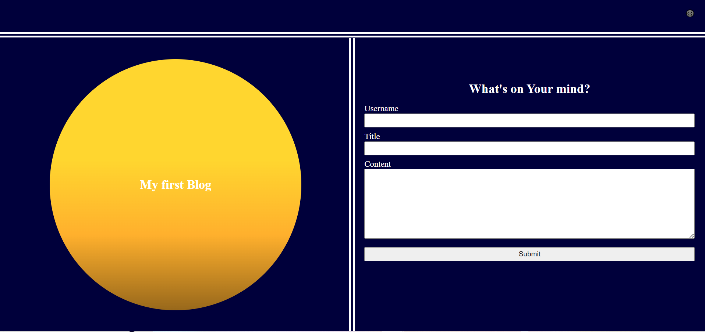
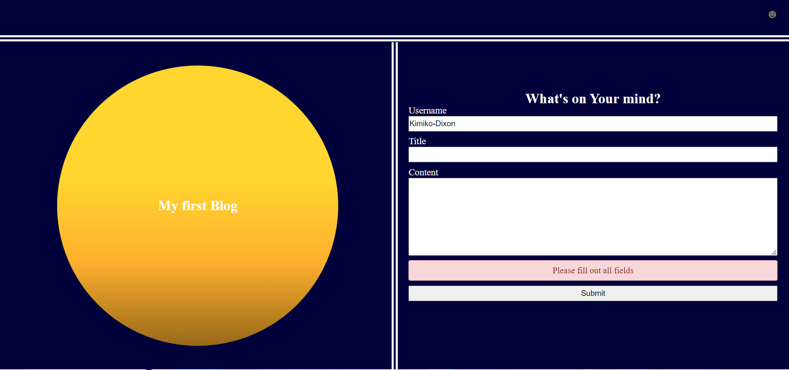
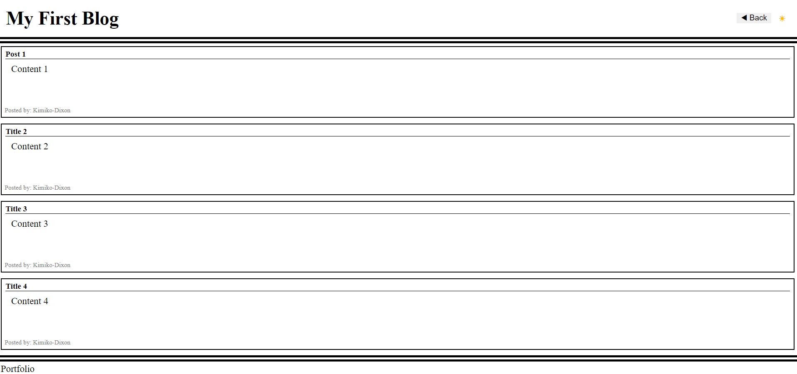

# Personal Blog

## Description

This webpage allows a user to type in their username, a title for their blog post and its content to be displayed on a page containing previous posts.

## Usage

To use this webpage, fill out all fields (username, title, and content) then click the submit button. You will be sent to a blog posts page that displays the post just created and previous posts. To create another post you can click the back button and fill out the form again. To change the theme of the page press the icon in the corner to change to either light or dark mode.

[Deployed Application](https://kimiko-dixon.github.io/Personal_Blog/)

## Credits

N/A

## License

LICENSE in repo.