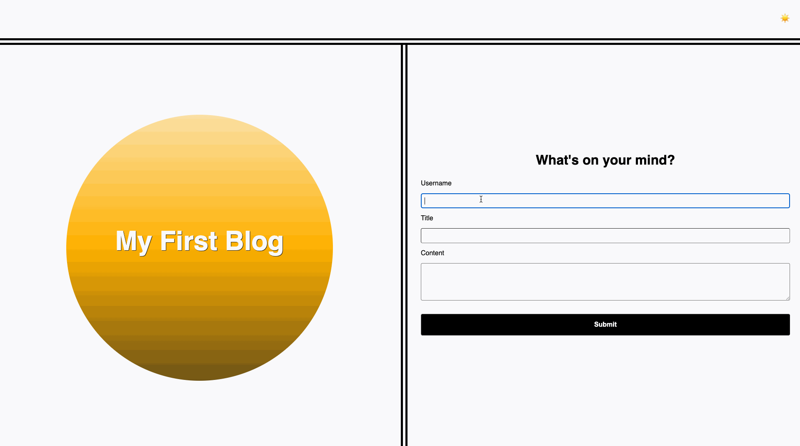

# 04 Web APIs: Personal Blog

## Your Task

In this challenge, you'll create a two-page website where users will input and view blog posts. It includes building a content form, dynamically rendering blog posts, and implementing a light/dark mode toggle. As you code, you'll gain practical JavaScript experience, explore the Document Object Model's power, and set the stage for more advanced tasks.

## User Story

```md
AS A marketing student,
I WANT a personal blog
SO THAT I can showcase my thoughts and experiences.
```

## Acceptance Criteria

```md


```

## Getting Started

Your file structure should look like the following:

```md
my-blog
├── assets
│   ├── css
│   │   ├── blog.css
│   │   ├── form.css
│   │   └── styles.css
│   └── js
│       ├── blog.js
│       ├── form.js
│       └── logic.js
├── index.html
├── blog.html
└── README.md
```

## Mock-Up

The following animation demonstrates the application functionality:



## Grading Requirements

> **Note**: If a Challenge assignment submission is marked as “0”, it is considered incomplete and will not count towards your graduation requirements. Examples of incomplete submissions include the following:
>
> * A repository that has no code
>
> * A repository that includes a unique name but nothing else
>
> * A repository that includes only a README file but nothing else
>
> * A repository that only includes starter code

This Challenge is graded based on the following criteria:

### Technical Acceptance Criteria: 40%

* Satisfies all of the preceding acceptance criteria.

### Deployment: 32%

* Application deployed at live URL.

* Application loads with no errors.

* Application GitHub URL submitted.

* GitHub repository contains application code.

### Application Quality: 15%

* Application user experience is intuitive and easy to navigate.

* Application user interface style is clean and polished.

* Application resembles the mock-up functionality provided in the Challenge instructions.

### Repository Quality: 13%

* Repository has a unique name.

* Repository follows best practices for file structure and naming conventions.

* Repository follows best practices for class/id naming conventions, indentation, quality comments, etc.

* Repository contains multiple descriptive commit messages.

* Repository contains quality readme file with description, screenshot, and link to deployed application.

## Review

You are required to submit BOTH of the following for review:

* The URL of the functional, deployed application.

* The URL of the GitHub repository, with a unique name and a readme describing the project.

---

© 2024 edX Boot Camps LLC. Confidential and Proprietary. All Rights Reserved.
